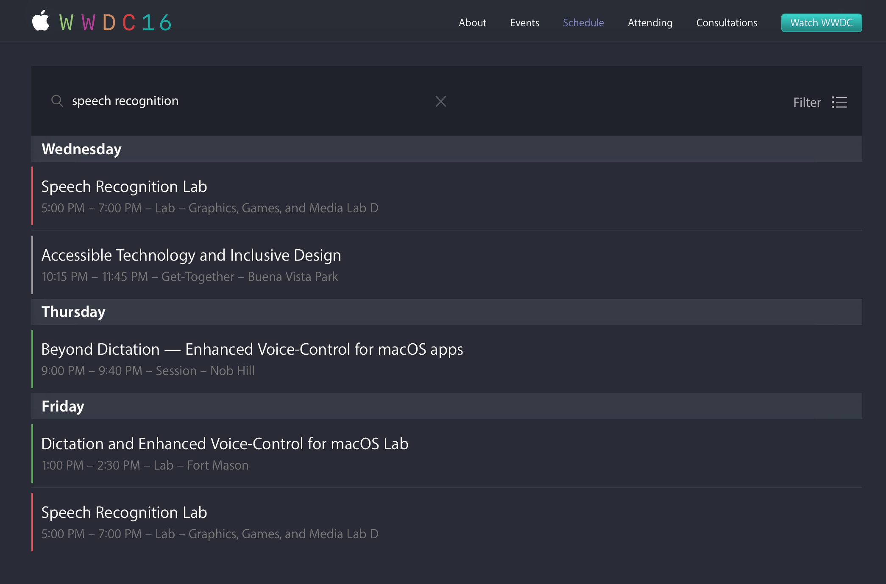

# The Developer's Conference

---


# The Developer's Conference

## *Francesco Perrotti-Garcia*

---

#[fit] A coisa mais **sensacional**
#[fit] que passou despercebida na WWDC

---


#[fit] *Francesco* 
#[fit] *Perrotti-Garcia*
#[fit] iOS Developer
#[fit] **_@fpg1503_**

---


---


---


---

#[fit] WWDC Schedule

---



---

#[fit] Session 509

---

#[fit] `Speech.framework`

---

#[fit] `import Speech`

---

#[fit] Siri

---

#[fit] Keyboard Dictation

---

#[fit] Normalmente online

---

#[fit] Usage description
#[fit] `Info.plist`

---

#[fit] `NSSpeechRecognitionUsageDescription`

---

#[fit] `SFSpeechRecognizer`

---

`public class func requestAuthorization(_ handler: (SFSpeechRecognizerAuthorizationStatus) -> Swift.Void)`

---

#[fit] `SFSpeechRecognizer.init?(locale: Locale)`

---

```swift
public enum SFSpeechRecognizerAuthorizationStatus : Int {
    case notDetermined
    case denied
    case restricted
    case authorized
}
```

---

#[fit] `SFSpeechURLRecognitionRequest`

---

- App de mensagem
- App de músicas
- Qualquer coisa gravada

---

#[fit] `SFSpeechAudioBufferRecognitionRequest`

---

```swift
let recognitionRequest = SFSpeechAudioBufferRecognitionRequest()
recognitionRequest.shouldReportPartialResults = true
```

---

`public func recognitionTask(with request: SFSpeechRecognitionRequest, resultHandler: (SFSpeechRecognitionResult?, NSError?) -> Swift.Void) -> SFSpeechRecognitionTask`

---

#[fit] Live com `AVAudioEngine`

---

```swift
let audioSession = AVAudioSession.sharedInstance()
try audioSession.setCategory(AVAudioSessionCategoryRecord)
try audioSession.setMode(AVAudioSessionModeMeasurement)
try audioSession.setActive(true, with: .notifyOthersOnDeactivation)
```

---

```swift
let audioEngine = AVAudioEngine()
guard let inputNode = audioEngine.inputNode else {
	fatalError("Audio engine has no input node")
}
```

---

#[fit] `AVAudioNode`

---

`public func installTap(onBus bus: AVAudioNodeBus, bufferSize: AVAudioFrameCount, format: AVAudioFormat?, block tapBlock: AVFoundation.AVAudioNodeTapBlock)`

---

`public typealias AVAudioNodeTapBlock = (AVAudioPCMBuffer, AVAudioTime) -> Swift.Void`


---

#[fit] Começar

---

```swift
let recordingFormat = inputNode.outputFormat(forBus: 0)
inputNode.installTap(onBus: 0, bufferSize: 1024, format: recordingFormat) {
    self.recognitionRequest?.append($0.0)
}

audioEngine.prepare()
try audioEngine.start()
```

---

#[fit] Terminar

---

```swift
audioEngine.stop()
recognitionRequest?.endAudio()
```

---

#[fit] Demo

---

This app has crashed because it attempted to access privacy-sensitive data without a usage description.  The app's Info.plist must contain an NSMicrophoneUsageDescription key with a string value explaining to the user how the app uses this data.

---

#[fit] Quais locales suportados?

---

#[fit] `SFSpeechRecognizer.supportedLocales()`

---

#[fit] [SpeakToMe](https://developer.apple.com/library/prerelease/content/samplecode/SpeakToMe/Introduction/Intro.html)

---

#[fit] Perguntas?

---

#[fit] Obrigado!

---

#[fit] github.com/fpg1503

